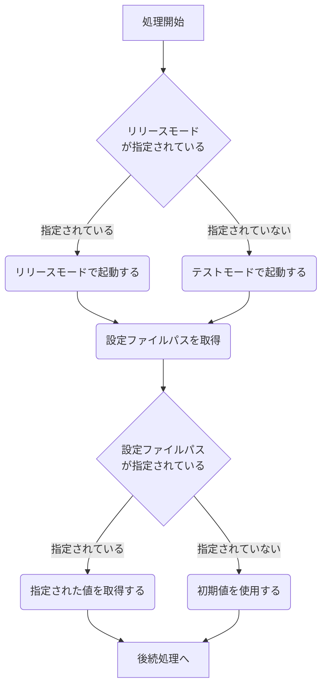

# 初期化処理

## 概要

* ボットの起動時に以下の処理を実行する
  1. [コマンドライン引数の取得](#コマンドライン引数の取得)
  2. [ボット設定ファイルの読み込み](#設定ファイル読み込み)
  3. [ボット起動](#ボット起動)
  4. DBとDiscordサーバーの[チャンネル情報を同期する](#チャンネル情報同期)
  5. [スラッシュコマンドの設定](#スラッシュコマンドの設定)

## 処理フロー (詳細設計)

* ボットの起動処理は以下のスクリプトで実行される
  * [index.js](../index.js)
    * 起動時引数やファイルの読み込みを行う
    * [options.js](../bot_system/options.js)に処理を記述
  * [ready.js](../bot_system/events/ready.js)
    * ボットがDiscordにアクセスしたときに実行される
* ボット起動まで処理はindex.jsで実行する
* ログイン開始時点ではチャンネル情報を取得できないため、DBとDiscordの同期ははready.jsで実行する

### コマンドライン引数の取得

* リリースモードを指定する
  * `--release_mode` または `-r` を実行時に付与するとリリースモードで実行する
  * 指定しない場合はテストモードで実行する
    * テストモード：チャットにメッセージを投稿しない
    * リリースモード：チャットにメッセージを投稿する
* 設定ファイルパス
  * 基本は`/praxi` から設定ファイルを参照する
  * `--option_dir <オプションディレクトリ>` を実行時に付与すると参照するパスが変更される

### 設定ファイル読み込み

* 設定ファイル（[settings.yml](../settings-template.yml)）から値を取得する
  * トークンが指定されていた場合は内部変数に格納する
  * 指定されていない場合はエラーメッセージを出力して終了する
* 設定ファイルが存在しない場合はエラーメッセージを出力して終了する

### ボット起動

* ボットに**intent**と**event**を付与して起動する
  * intent：ボットの権限
  * event：ボットプログラムの動作トリガー
* 使用している[intent](intent一覧.md)と[event](event一覧)はリンク先のファイルを参照

### チャンネル情報同期

* 現在はJSONファイルで管理しているが、DBに移行する予定であるため仕様書作成は保留する
* DB設計が定まり次第作成する

### スラッシュコマンドの設定

* [/notify_ch](../bot_system/commands/notify_ch.js)など/から始まる特定のメッセージをコマンドとしてボットを呼び出す
* [commandsディレクトリ](../bot_system/commands/)以下のファイルを[commands.js](../bot_system/commands.js)で集約し[ready.js](../bot_system/events/ready.js)で設定
* TBD 詳細は別仕様書を作成予定
